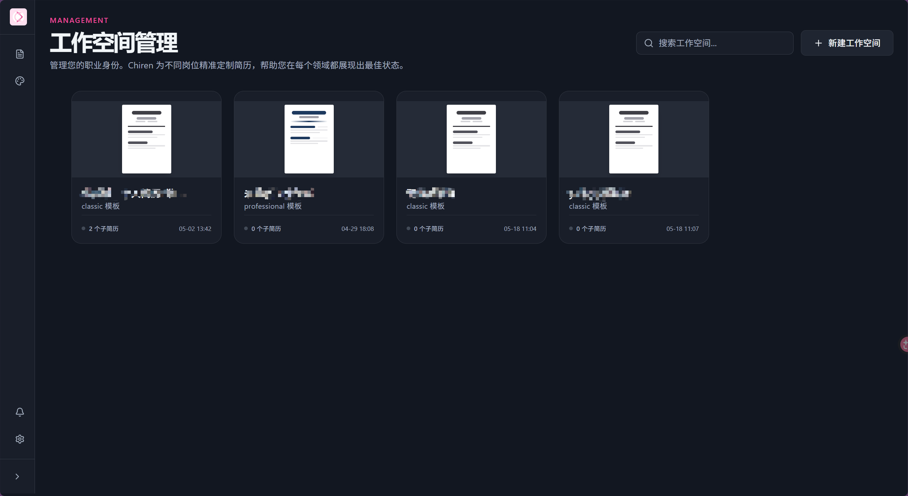
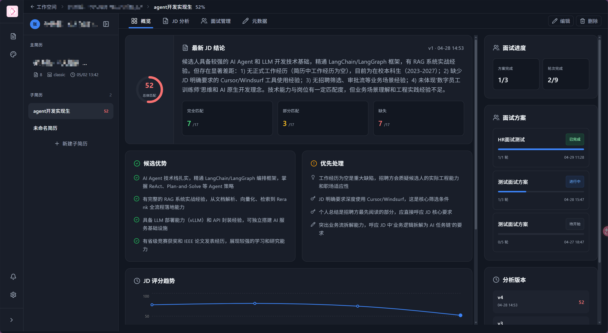
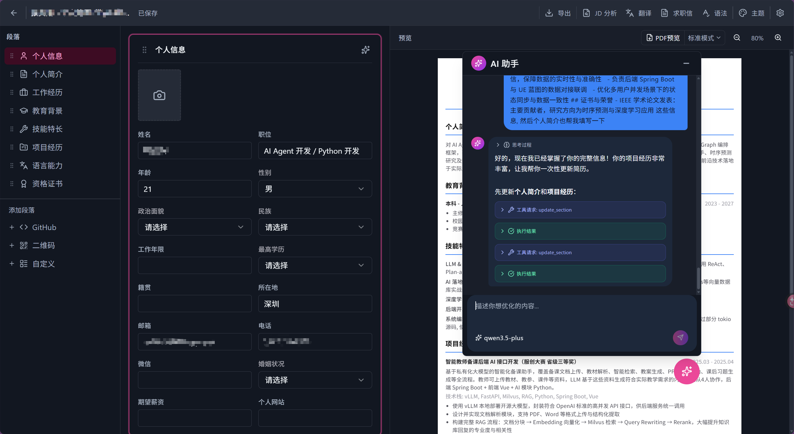
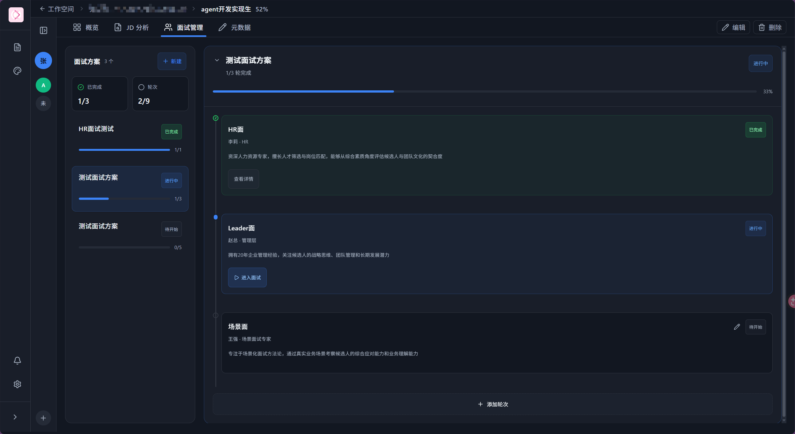
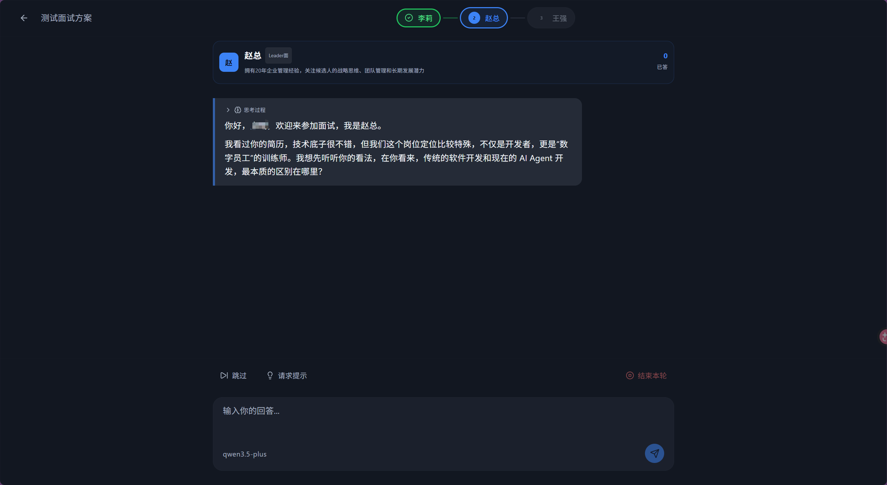

# Chiren — AI 辅助简历编写与面试准备平台

Chiren 是一个全栈 AI 辅助工具，帮助用户高效编写简历、分析岗位需求（JD）、模拟面试并润色简历内容。内置丰富的简历模板，支持一键导出。

---

## ✨ 功能特性

- **📄 简历编辑** — 内置丰富的简历模板，支持拖拽排序、自定义主题配色，实时预览
- **🔍 JD 智能分析** — 粘贴岗位描述，AI 自动分析关键要求，评估匹配度
- **🤖 AI 润色** — 选中内容即可让 AI 优化措辞、调整语气、改进表达
- **🎙️ 模拟面试** — 基于你的简历和 JD 生成模拟面试，AI 扮演面试官提问并反馈
- **📎 求职信生成** — 一键生成匹配岗位的求职信
- **📤 多格式导出** — 支持 PDF 导出（含浏览器渲染），可直接下载或打印
- **🌗 明暗主题** — 支持 Light / Dark / System 三模式切换

---

## 🖼️ 界面预览

| 页面 | 截图 |
|------|------|
| 工作空间主页 |  |
| 工作空间详情 |  |
| AI 润色简历 |  |
| 模拟面试主页 |  |
| 模拟面试详情 |  |

---

## 🏗️ 技术栈

| 层 | 技术 |
|---|---|
| **前端** | React 19 + TypeScript + Vite 8 + Tailwind CSS 3 + Zustand 5 |
| **UI 组件** | Shadcn/ui（基于 Radix UI 原语） |
| **后端** | Python 3.13 + FastAPI + SQLAlchemy（异步） + SQLite |
| **AI 集成** | OpenAI / Anthropic / Gemini 多 provider 支持 |
| **导出** | Playwright 浏览器渲染 + PyMuPDF |
| **包管理** | 前端 npm / 后端 uv |

---

## 🚀 快速开始

### 前置条件

- **Node.js** >= 18
- **Python** >= 3.13
- **uv**（Python 包管理器）
- **Playwright 浏览器**（用于 PDF 导出）

### 1. 启动后端

```bash
cd backend

# 创建虚拟环境并安装依赖
uv sync

# 初始化 Playwright 浏览器（首次需要）
uv run playwright install chromium

# 启动后端服务（默认 http://localhost:8000）
uv run uvicorn main:app
```

### 2. 启动前端

```bash
cd frontend

# 安装依赖
npm install

# 启动开发服务器（默认 http://localhost:5173）
npm run dev
```

### 3. 访问

打开浏览器访问 `http://localhost:5173` 即可使用。

---

## 📁 项目结构

```
Chiren/
├── assets/                          # 截图资源（README 引用）
│   ├── workspace-home.png
│   ├── workspace-detail.png
│   ├── resume-ai-edit.png
│   ├── mock-interview-home.png
│   └── mock-interview-detail.png
├── backend/                         # FastAPI 后端
│   ├── apps/
│   │   ├── config/                  # 配置管理
│   │   ├── conversation_message/    # 对话消息
│   │   ├── cover_letter/            # 求职信生成
│   │   ├── export/                  # PDF 导出（Playwright）
│   │   ├── interview/               # 模拟面试
│   │   ├── jd_analysis/             # JD 智能分析
│   │   ├── parser/                  # 简历解析
│   │   ├── resume/                  # 简历 CRUD
│   │   ├── resume_assistant/        # AI 润色助手
│   │   ├── resume_section/          # 简历章节管理
│   │   ├── template/                # 模板管理
│   │   └── work/                    # 后台任务管理
│   ├── shared/                      # 共享模型与数据库
│   ├── main.py                      # 应用入口
│   └── pyproject.toml
├── frontend/                        # React 前端
│   └── src/
│       ├── components/
│       │   ├── ui/                  # Shadcn UI 组件
│       │   ├── editor/              # 简历编辑器
│       │   ├── workspace/           # 工作空间组件
│       │   ├── layout/              # 布局（侧边栏等）
│       │   ├── preview/             # 简历预览
│       │   └── settings/            # 设置面板
│       ├── pages/                   # 页面级组件
│       │   ├── Dashboard.tsx        # 工作空间主页
│       │   ├── WorkspaceDetail.tsx  # 工作空间详情
│       │   ├── EditorPage.tsx       # 简历编辑页
│       │   ├── InterviewPage.tsx    # 模拟面试页
│       │   └── TemplateGallery.tsx  # 模板库
│       ├── stores/                  # Zustand 状态管理
│       ├── lib/                     # 工具函数与 API 封装
│       └── types/                   # TypeScript 类型定义
└── README.md
```

---

## ⚙️ 配置说明

在应用界面的 **设置** 面板中可配置：

- **AI Provider** — 选择 OpenAI / Anthropic / Gemini
- **API Key & Base URL** — 自定义接口地址（兼容中转 API）
- **自动保存** — 可开启/关闭并设置保存间隔

---

## 📄 许可证

MIT
